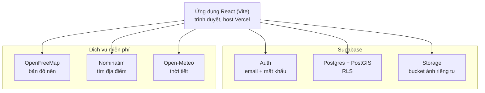

# Kế hoạch dự án Hành trình

> Bản xuất từ Claude Doc "Kế hoạch dự án Hành trình" ngày 24/09/2026. Khi kế hoạch thay đổi, cập nhật file này (hoặc xuất lại từ doc).

## Tổng quan

Hành trình là web nhật ký du lịch trên bản đồ: ghim nơi đã đến, lưu ảnh có vị trí, ghi lại lộ trình đi bộ và chia sẻ với bạn bè. Giai đoạn đầu chỉ dùng dịch vụ miễn phí.

- **Người dùng:** trước hết là bản thân (nhật ký riêng); sau đó bạn bè có tài khoản, bản đồ riêng và chuyến đi chung.
- **Thiết bị:** Android và iPhone qua trình duyệt. Làm web React trước, app native sau.
- **Nguyên tắc:** chi phí $0 khi khởi đầu; dữ liệu riêng tư mặc định; chỉ dùng chuẩn mở để dễ đổi nhà cung cấp.
- **Hiện trạng:** mã nguồn v0.1 (phần lõi giai đoạn 1) đã viết xong, chưa build và chạy thử thực tế.

## Kiến trúc hệ thống

SPA React chạy hoàn toàn trên trình duyệt, gọi thẳng Supabase và các dịch vụ miễn phí; không có server trung gian. Phân quyền nằm trong database bằng Row Level Security (RLS).

- **Không tự viết backend:** Supabase lo đăng nhập, database và lưu file. Trình duyệt xử lý ảnh (đọc EXIF, nén, xoá metadata) trước khi upload.
- **Chuẩn mở:** Postgres, API tương thích S3 và dữ liệu OpenStreetMap cho phép đổi nhà cung cấp mà không viết lại app.
- **Đánh đổi của SPA:** link chia sẻ chưa có ảnh xem trước (OG preview); bổ sung bằng Edge Function ở giai đoạn 2.
- **Mở rộng dự kiến:** Supabase Realtime, pg_cron, Edge Functions; Cloudflare R2 cho ảnh; Capacitor cho app ghi GPS chạy nền.

## Công nghệ sử dụng

| Tầng | Công nghệ | Vai trò | Giới hạn gói miễn phí |
| --- | --- | --- | --- |
| Frontend | React 18 + Vite | Giao diện SPA | Mã nguồn mở |
| Bản đồ | MapLibre GL JS + OpenFreeMap | Bản đồ vector, gom cụm, vẽ lộ trình | Không giới hạn lượt xem, không cần API key, phải ghi nguồn |
| Xử lý ảnh | exifr, browser-image-compression | Đọc GPS và ngày chụp; nén, xoá EXIF | Mã nguồn mở |
| Lộ trình | Geolocation API, Screen Wake Lock API, @tmcw/togeojson | Ghi GPS trực tiếp, nhập GPX | API trình duyệt, cần HTTPS |
| Backend | Supabase (Postgres + PostGIS, Auth, Storage) | Dữ liệu, đăng nhập, lưu ảnh | 500 MB database, 1 GB file, 5 GB băng thông/tháng, 2 project; tạm dừng sau 7 ngày không hoạt động |
| Tìm địa điểm | Nominatim | Tìm theo tên, gợi ý tên từ toạ độ | Tối đa 1 request/giây, không dùng cho gợi ý khi gõ |
| Thời tiết | Open-Meteo | Tự điền thời tiết theo ngày và vị trí | Miễn phí cho mục đích phi thương mại |
| Hosting | Vercel Hobby | Deploy, HTTPS | Chỉ dùng phi thương mại |
| Mở rộng | Cloudflare R2 | Lưu ảnh khi vượt 1 GB | 10 GB lưu trữ, không phí băng thông tải ra |
| Mở rộng | Web Push, Capacitor | Thông báo; app ghi GPS chạy nền | iOS cần thêm web vào màn hình chính; phát hành app iOS cần tài khoản Apple Developer (trả phí) |

## Mô hình dữ liệu

| Bảng | Nội dung chính | Giai đoạn |
| --- | --- | --- |
| `places` | Địa điểm đã đến/muốn đến: toạ độ (cột PostGIS tự sinh), ngày, ghi chú, cảm xúc, thời tiết, tag, mức chia sẻ | 1 (đã có) |
| `photos` | Ảnh gắn với địa điểm: đường dẫn Storage, thời điểm chụp, GPS gốc | 1 (đã có) |
| `tracks` | Lộ trình: mảng điểm `[lng, lat, thời gian]` JSONB, quãng đường, nguồn | 1 (đã có) |
| `trips` | Chuyến đi gom địa điểm và lộ trình | 1 |
| `share_links` | Token chia sẻ theo chuyến đi | 1 |
| `privacy_zones` | Vùng riêng tư quanh nhà để cắt lộ trình khi chia sẻ | 1 |
| `provinces_63`, `provinces_34` | Ranh giới tỉnh trước/sau sáp nhập cho scratch map | 1 |
| `friendships` | Lời mời và quan hệ bạn bè | 2 |
| `trip_members` | Thành viên chuyến đi nhóm (owner, editor, viewer) | 2 |
| `comments`, `reactions` | Bình luận, thả tim; chỉ bạn bè | 2 |

## Danh sách tính năng

"Đã xong" = đã có code nhưng chưa build và chạy thử thực tế.

| # | Nhóm | Tính năng | Giai đoạn | Trạng thái |
| --- | --- | --- | --- | --- |
| 1 | Nền tảng | Đăng nhập bằng email + mật khẩu (link qua email khi quên mật khẩu, đặt lại ở tab Tôi) | 1 | Đã xong |
| 2 | Nền tảng | Phân quyền RLS, bucket ảnh riêng tư | 1 | Đã xong |
| 3 | Bản đồ | Bản đồ vector, gom cụm điểm, tên địa điểm khi phóng to | 1 | Đã xong |
| 4 | Check-in | Ghim bằng cách chạm bản đồ, kéo thả để chỉnh vị trí | 1 | Đã xong |
| 5 | Check-in | Tìm địa điểm theo tên, tự gợi ý tên từ toạ độ | 1 | Đã xong |
| 6 | Ảnh | Đọc GPS và ngày chụp từ EXIF, tự đặt vị trí và ngày | 1 | Đã xong |
| 7 | Ảnh | Nén ảnh và xoá EXIF trước khi upload | 1 | Đã xong |
| 8 | Nhật ký | Ghi chú, cảm xúc, tag | 1 | Đã xong |
| 9 | Nhật ký | Tự điền thời tiết theo ngày và vị trí | 1 | Đã xong |
| 10 | Nhật ký | Wishlist (nơi muốn đến) | 1 | Đã xong |
| 11 | Nhật ký | Timeline theo tháng, tìm không dấu, lọc theo loại, ngày, #tag | 1 | Đã xong |
| 12 | Thống kê | Số nơi đã đến, tổng km đã đi | 1 | Đã xong |
| 13 | Lộ trình | Ghi GPS trực tiếp, giữ màn hình sáng, lọc nhiễu | 1 | Đã xong |
| 14 | Lộ trình | Tự khôi phục lộ trình chưa lưu khi tab bị tải lại | 1 | Đã xong |
| 15 | Lộ trình | Nhập file GPX từ ứng dụng khác | 1 | Đã xong |
| 16 | Vận hành | Build, deploy Vercel, kiểm thử trên Android và iPhone | 1 | Đang làm |
| 17 | Check-in | Sửa check-in, thêm ảnh vào địa điểm đã có | 1 | Đang làm |
| 18 | Chuyến đi | Nhóm địa điểm và lộ trình thành chuyến đi | 1 | Đang làm |
| 19 | Chia sẻ | Link chia sẻ riêng cho từng chuyến (riêng tư, không công khai, công khai) | 1 | Đang làm |
| 20 | Quyền riêng tư | Vùng riêng tư: cắt đoạn lộ trình gần nhà khi chia sẻ | 1 | Đang làm |
| 21 | Bản đồ | Scratch map tô màu tỉnh đã đến, chuyển đổi 63/34 tỉnh | 1 | Đang làm |
| 22 | Thống kê | Số tỉnh và quốc gia đã đến | 1 | Đang làm |
| 23 | Ảnh | Ghép ảnh không có GPS vào lộ trình theo thời gian chụp | 1 | Đang làm |
| 24 | Vận hành | GitHub Actions giữ Supabase không bị tạm dừng | 1 | Đang làm |
| 25 | Xã hội | Tài khoản cho bạn bè, lời mời kết bạn | 2 | Kế hoạch |
| 26 | Xã hội | Mỗi người có bản đồ riêng | 2 | Kế hoạch |
| 27 | Xã hội | Bình luận, thả tim (chỉ bạn bè), cập nhật tức thì | 2 | Kế hoạch |
| 28 | Xã hội | Chuyến đi nhóm, cùng ghi chung | 2 | Kế hoạch |
| 29 | Hạ tầng | Chuyển lưu ảnh sang Cloudflare R2 | 2 | Kế hoạch |
| 30 | Chia sẻ | Ảnh xem trước (OG preview) cho link chia sẻ | 2 | Kế hoạch |
| 31 | Trình bày | Replay hành trình dạng story | 3 | Kế hoạch |
| 32 | Trình bày | Xuất ảnh, poster bản đồ | 3 | Kế hoạch |
| 33 | Tiện ích | Nhắc "ngày này năm trước" (pg_cron + Web Push) | 3 | Kế hoạch |
| 34 | Tiện ích | PWA dùng khi mất mạng, đồng bộ sau | 3 | Kế hoạch |
| 35 | Tiện ích | Nhập dữ liệu từ Google Takeout và Google Maps Timeline | 3 | Kế hoạch |
| 36 | Lộ trình | App Capacitor ghi GPS khi chạy nền | 3 | Kế hoạch |
| 37 | Bản đồ | Heatmap các khu vực đi qua nhiều | 3 | Kế hoạch |

## Rủi ro và giới hạn kỹ thuật

| Rủi ro | Ảnh hưởng | Phương án |
| --- | --- | --- |
| Trình duyệt ngừng cập nhật GPS khi khoá màn hình, nhất là iOS Safari | Lộ trình đứt đoạn | Wake Lock; lộ trình dài ghi bằng app native rồi nhập GPX; sau này Capacitor |
| 1 GB lưu ảnh Supabase dùng chung | Hết dung lượng khi mở cho bạn bè | Nén ảnh ~300 KB; chuyển sang R2 ở giai đoạn 2 |
| Supabase Free tạm dừng sau 7 ngày không hoạt động | Link chia sẻ không truy cập được | GitHub Actions gọi database định kỳ |
| Dữ liệu ranh giới 34 tỉnh mới còn ít | Chậm scratch map | Kiểm tra nguồn và giấy phép trước |
| Ảnh từ Zalo, Facebook mất EXIF | Không tự lấy được vị trí | Check-in thủ công; ghép ảnh vào lộ trình theo giờ chụp |
| Chrome/Android không giải mã HEIC để nén | Upload ảnh iPhone lỗi trên Android | Safari thường tự chuyển sang JPEG; cân nhắc thư viện chuyển HEIC |
| Google siết API Photos, Timeline lưu trên thiết bị | Không nhập tự động được | Người dùng tự xuất file rồi upload |
| Web Push iOS chỉ chạy khi đã thêm web vào màn hình chính | Nhắc kỷ niệm không tới | Hướng dẫn cài PWA |
| Vercel Hobby, Open-Meteo chỉ miễn phí phi thương mại | Phải đổi gói nếu thu phí | Chuyển gói hoặc host khác |

## Bước tiếp theo

- [ ] Tạo project Supabase, chạy `supabase/schema.sql`, cấu hình Site URL
- [ ] `npm install`, chạy local, sửa lỗi build nếu có
- [ ] Deploy Vercel để có HTTPS, thử ghi GPS trên Android và iPhone
- [x] Áp dụng thiết kế mới (docs/DESIGN.md): thanh tab dưới, mỗi tab một màn hình, dark mode
- [ ] Làm tiếp: sửa check-in và thêm ảnh vào địa điểm đã có
- [ ] Làm tiếp: chuyến đi và link chia sẻ
